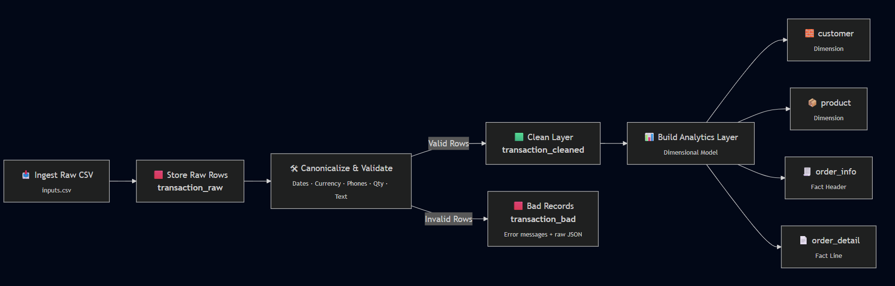
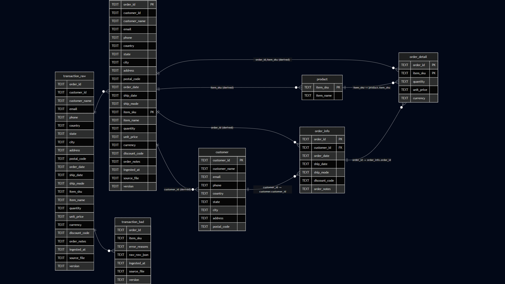
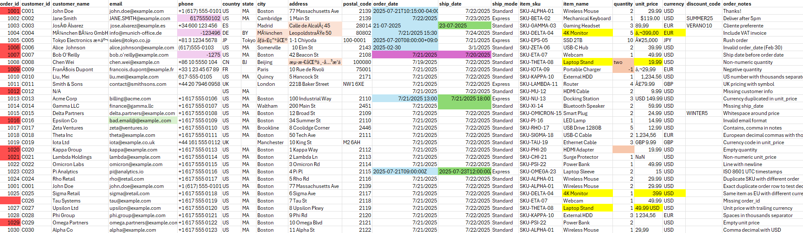

# Data Ingestion Pipeline

This project implements a local data ingestion pipeline that reads messy CSV files, cleans and validates their contents, and loads them into a structured analytical model with full traceability and metadata.

<br>

---

<br>

## 1) Overview

### End-to-End Pipeline Flow
1. Ingest raw CSV  
2. Write raw rows into `transaction_raw`
3. Canonicalize and validate → produce `clean_rows` + `bad_rows`
4. Insert validated rows into `transaction_cleaned`
5. Insert invalid rows into `transaction_bad`
6. Derive final analytics layer split into Dims and Fact Table
   - `customer`
   - `product`
   - `order_info`
   - `order_detail`

    


#### Key Considerations

- **UTC (Zulu) timestamps** — Ensures consistent, timezone‑agnostic tracking across all ingestion runs.
- **Read‑as‑TEXT ingestion** — Prevents failures from malformed or mixed‑locale data; parsing is deferred to controlled Python logic.
- **Schema‑on‑read (ELT) approach** — Canonicalize first, validate next; supports resilience against messy real‑world CSVs. Supports batch and stream processing.
- **Strict canonicalization before validation** — Normalizes dates, currency, quantities, phones, and emails to guarantee consistent rule enforcement.
- **Three‑Layer Architecture (Bronze → Silver → Gold)**  
  - **Raw/Staging (Bronze):** Preserve original rows exactly as received.  
  - **Clean/Validated (Silver):** Standardized, trusted data.  
  - **Analytics (Gold):** Dimensions and fact tables in normalized form (1NF/2NF/3NF).
- **UPSERT‑based ingestion** — Ensures idempotency; safe to reprocess files without creating duplicates.
- **Global data normalization** — Handles Unicode text, multilingual inputs, international currency formats, and locale‑specific number/date variations.
- **Reproducibility & lineage** — Every row captures `ingested_at`, `source_file`, `version`, and raw JSON for full traceability.
- **Lightweight but scalable design** — SQLite used for local simplicity, while structure is migration‑ready for PostgreSQL or cloud warehouses.
- **SCD‑Friendly** — Raw layer naturally supports SCD2 history; clean layer models SCD1 for simplified consumption.


<br>

---

<br>


## 2) Project Structure


saathvik-interview-assignment/     
├── input.csv               # Input CSV file    
├── main.py                 # Pipeline orchestration    
├── io_utils.py             # I/O Helper functions    
├── cleanse.py              # Data Preprocessing file    
├── db_utils.py             # DB interface - inserts, upserts, derivations    
├── schema.sql              # DB Table Initialization    
└── README.md               # Documentation    


<br>

---

<br>


## 3) Prerequisites
- Python **3.9+**
- `pip`
- SQLite (bundled with Python as `sqlite3`)


<br>

---

<br>


## 4) Setup

### A. Clone & enter the project
```bash
git clone https://github.com/saathvik13/saathvik-interview-assignment
```

### B. Create a virtual environment and install deps (Windows)
```bash
python -m venv .venv
.venv\Scripts\activate
pip install pandas
```

### C. How to Run
```bash
python main.py --csv ./input.csv --db ./shopping.db
```


<br>

---

<br>


## 5) Schema Design
The pipeline uses a three‑layer schema—**Staging (Bronze Layer) → Storage(Silver Layer) → Analytic (Gold Layer)**—to ensure traceability, data quality, and reliable downstream modeling.




### BRONZE LAYER
- #### Staging Layer  (`transaction_raw`)
   - Stores the CSV exactly as received.
   - All fields kept as **TEXT** to avoid ingestion failures.
   - Includes metadata (V`ingested_at`, `source_file`, `version`).
   - **Purpose:** Preserve original data for auditability and reprocessing.

### SILVER LAYER 
- #### Clean Layer  (`transaction_cleaned`)
   - Contains validated, normalized, and trusted records.
   - PK: **(order_id, item_sku)** ensures idempotent ingestion.
   - Standardizes dates, currency, phone, quantity, and text fields.
   - **Purpose:** Single source of truth for analytics.    

- #### Bad Records (`transaction_bad`)
   - Stores rejected rows with error reasons and raw JSON.
   - **Purpose:** Full visibility into data quality issues without losing data.

### GOLD LAYER
- #### Dimensions
   - **customer** (PK: `customer_id`)
   - **product** (PK: `item_sku`)
   - **Purpose:** Deduplicate entities and provide consistent lookup tables.

- #### Fact Tables
   - **order_info**: Order‑level attributes (header).
   - **order_detail**: Line‑level transactions per `(order_id, item_sku)`.
   - **Purpose:** Kimball‑style star schema for efficient analytics.


#### *Why This Design Works Well*
- **Traceable:** Every clean/bad row maps back to raw data.
- **Reliable:** Natural keys enforce idempotency and eliminate duplicates.
- **Analytics‑ready:** Star schema supports BI and reporting use cases.
- **Production‑aligned:** Mirrors real-world ingestion patterns (Raw → Clean → Dims/Facts).
- **Extensible:** Easy to add SCD2, FX normalization, enrichment, and metadata tables.


<br>

---

<br>


## 7) Data Quality Issues

    
The CSV input is treated as untrusted. The goal is to ensure only standardized, trustworthy data enters analytics tables while preserving full lineage for rejected rows.     
This pipeline follows: **canonicalize → validate → dedupe → route (clean/bad) → load**.     


#### Data Quality Legend     

| Color | Issue Type |
|---|---|
| 🔴 Red | Bad records (multiple issues) |
| 🟩 Light Green | Invalid email format |
| 🟪 Light Purple | Inconsistent phone format |
| 🟧 Light Orange | Non‑ASCII / corrupt text |
| 🔵 Light Blue | Inconsistent order date formats |
| 🟢 Dark Green | Inconsistent ship date formats |
| 🟡 Yellow | Conflicting prices for same product |
| 🟣 Dark Purple | order_date > ship_date |
| 🟧 Dark Orange | Inconsistent numeric format |    

#### Canonicalization 
- **Unicode normalization** - fix accented characters.
- **Whitespace cleanup** - trim, collapse internal spacing, strip noise.
- **Phone normalization** - using country dial-code mapping;  keep `+` and digits; remove leading zeros in national numbers.
- **Price & currency parsing**  
  - Detect currency from symbols/ISO (e.g., `$`, `€`, `GBP`, `USD`)  
  - Handle US/EU formats (e.g., `$1,234.56`, `1.234,56 €`)  
  - Output: numeric `unit_price`, ISO `currency`
- **Quantity parsing** - numeric and words (`"two" → 2`); integers only.
- **Date parsing** - across multiple formats & time zones → `YYYY-MM-DD` (UTC normalized).
- **Order ID extraction** -  mixed strings (strip non-digits).
- **Convert `"N/A"` / empty strings** to `None`.

#### Validation Rules (Business & Data Integrity)
- `order_id` **required** and numeric after cleanup.
- `order_date` valid; `ship_date ≥ order_date`.
- `quantity` is **integer ≥ 0**.
- `unit_price` is **number ≥ 0**.
- `currency` **required**.
- `item_sku` **required**.
- **Email** must be syntactically valid.
- At least **one contact method** present (email/phone/address).
- At least **one customer identifier** (customer_id or customer_name).

#### Duplicate Handling
- **Exact duplicates** → silently ignored.
- **Conflicts** on `(order_id, item_sku)` → **rejected** with reasons.

#### Routing & Persistence
- **Valid rows → `transaction_cleaned`** (PK: `(order_id, item_sku)`) for idempotent loads.
- **Invalid rows → `transaction_bad`** with:
  - `error_reasons` (list of validation failures)
  - `raw_row_json` (full raw payload)
  - `ingested_at`, `source_file`, `version`
- **All rows → `transaction_raw`** (immutable copy + ingestion metadata) for lineage and replay.

#### Outcomes & Benefits
- **Clean, analytics-ready** data feeds `customer`, `product`, `order_info`, `order_detail`.
- **Traceability**: Every clean/bad row maps back to raw with metadata.
- **Idempotent & safe reruns** via natural key `(order_id, item_sku)` and consistent canonicalization.
- **Governance**: Bad data is quarantined, not dropped, enabling audits, fixes, and reprocessing.


<br>

---

<br>


## 9) Known Limitations (Data Engineering)

#### Data Modeling & Storage
- All columns stored as TEXT — no DB-level type enforcement for Storage Layer (Silver)
- Limited schema evolution — new/changed CSV columns not detected.
- Pricing only at transaction level — no normalized product pricing or FX handling.

#### Data Quality & Validation
- Hardcoded reference dictionaries (currency, phone prefixes, word mapping).
- Basic currency detection — struggles with mixed-locale formats.
- Simplified phone normalization — no full E.164 validation.
- Minimal email validation — syntax-only, no domain/alias checks.
- Basic Data Enhancement — missing attributes not inferred from history or reference data.

#### Reliability, Lineage & Observability
- Incomplete ingestion metadata table (batch_id, checksums, runtime metrics).
- Multi-file ingestion not robust — no dedupe or repeated-file detection.
- No checkpointing — large files must be reprocessed entirely on failure.

#### Testing, CI/CD & Orchestration
- Missing unit tests, integration tests, or data tests.
- CI/CD pipeline (GitHub Actions) for linting, testing, or validations.
- No `.env` configuration — settings are hardcoded.


<br>

---

<br>


## 10) Next Steps (Roadmap)

#### Data Modeling Enhancements
- Extend **SCD Type 2** for customer/product with effective dating and hash-diffing.
- Implement **schema evolution** to detect and handle new/changed CSV columns.
- Introduce **currency normalization** using FX rates and base currency.
- Move lookup dictionaries to governed **reference tables**.

#### Data Quality & Enrichment
- Build a **config-driven rules engine** (YAML/JSON) for validation.
- Add **Data IMputation** logic to fill missing customer/product attributes.
- Improve text cleanup (email normalization, multilingual handling).

#### Metadata, Logging & Observability
- Create an **ingestion_run** table for lineage, checksums, row counts, and errors.
- Add **structured JSON logs** with run_id, timestamps, and DQ metrics.
- Build **DQ dashboards** (Metabase/Grafana) for null %, failures, trends.

#### Testing & CI/CD
- Add unit tests for parsing/validation and integration tests for DB flows.
- Add GitHub Actions workflows for linting, testing, and validation gates.
- Introduce `.env` and configuration-driven environment separation.

#### Scalability & Orchestration
- Migrate from SQLite to **PostgreSQL** (or warehouse engines).
- Add **Airflow/Prefect orchestration** for scheduled runs, retries, and lineage tracking.
- Implement **checkpointed & partitioned ingestion** for large files.
